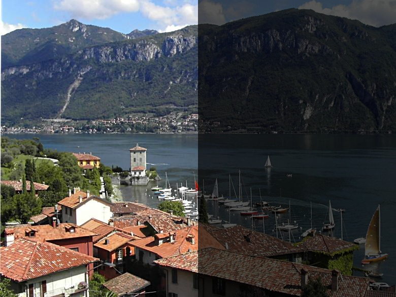

Parte 2 - SAVI

Miguel Riem Oliveira <mriem@ua.pt>
2022-2023

# Sumário

- Exercícios de processamento de imagem 

# Exercícios

## Exercício 1 - Nightfall

O objetivo é carregar a imagem _lake.jpg_ do disco e mostrá-la.

Depois deve-se diminuir a intensidade dos píxeis da metade direita da imagem para simular uma fotografia noturna.

Finalmente, faça um efeito de anoitecer progressivo variando o valor do divisor.

Grave um vídeo com o processo de anoitecer da imagem.

## Exercício 2 - Onde está o Wally?

Carregue a imagem *scene.jpg* e o modelo *wally.png*

Utilizando template matching encontre o Wally na imagem.

Anote a posição do Wally desenhando um círculo à volta da sua cara.

## Exercício 3 - Ainda o Wally?

Experimente o programa do exercício anterior para as novas imagens **school.jpg** e **beach.jpg**. Porque não funciona? 

Crie um sistema de carregar e arrastar com o rato que permita ao utilizador rapidamente criar um novo template para utilizar.

## Exercício 4 - Destaca o Wally?

Destaque o Wally detetado colocando todas as zonas da imagem que não são o Wally a cinzento.

