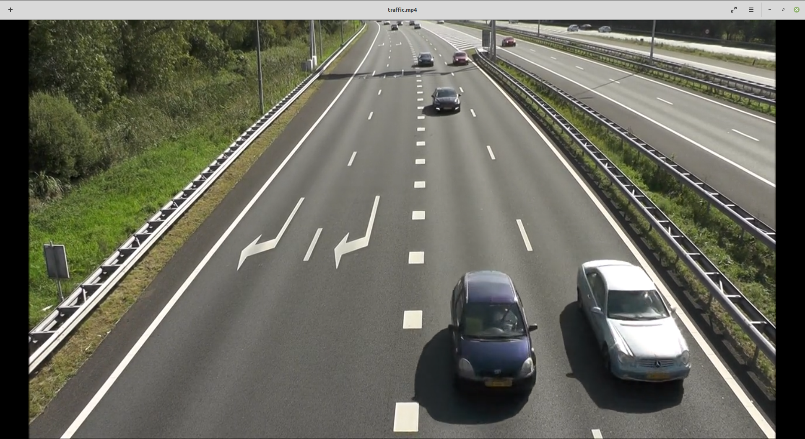

Parte 3 - SAVI
=============
Miguel Riem Oliveira <mriem@ua.pt>
2022-2023

# Sumário

- Processamento de vídeo

# Exercícios

## Exercício 1 - Controlo de tráfego

Utilize o vídeo **traffic.mp4** para fazer um sistema de contagem de veículos.
O objetivo é saber quantos veículos passaram.

## Exercício 2 - Controlo de tráfego

Obtenha a contagem separada para cada faixa de rodagem.

## Exercício 3 - Cor

O programa deve imprimir um relatório com os eventos de passagem de veículos, com a faixa de rodagem e a cor do veículo.

