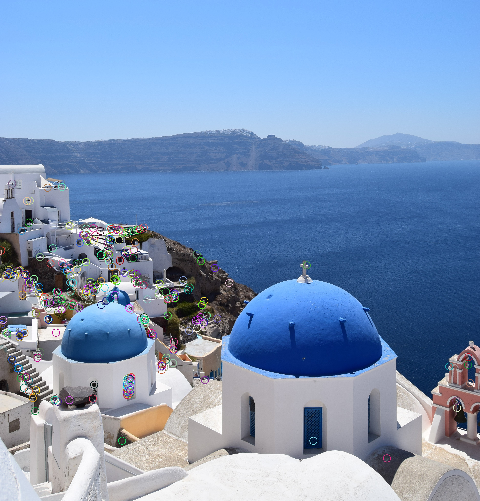
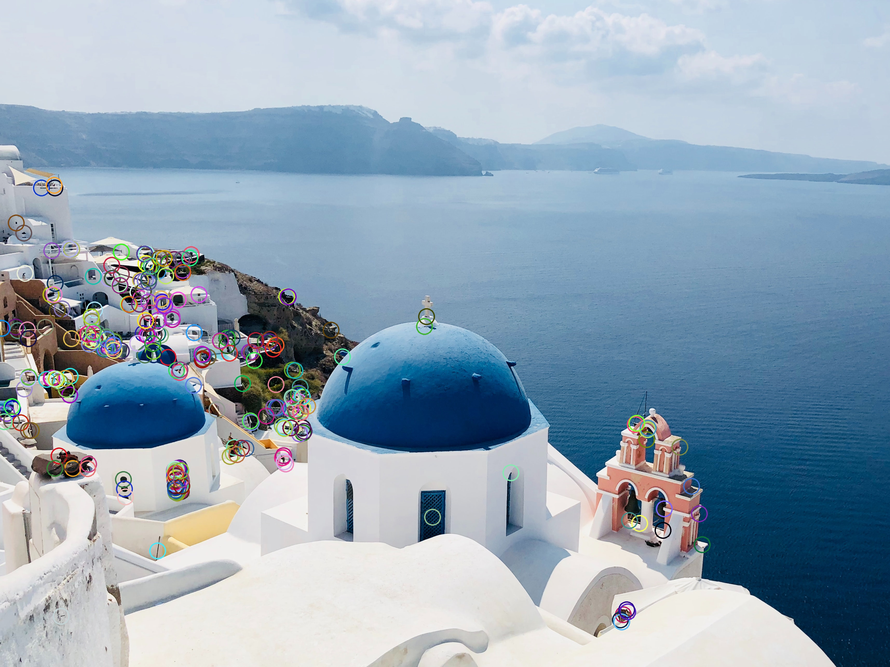
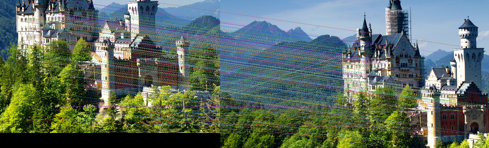

Parte 6 - SAVI
==============
Miguel Riem Oliveira <mriem@ua.pt>
2022-2023

# Sumário

- Features 
- Feature matching
- Image Mosaicking

# Exercícios

## Exercício 1 - Tutorials de features do opencv

Faça os exercícios do tutorial de OpenCV sobre [Feature Detection and Description](https://docs.opencv.org/4.x/db/d27/tutorial_py_table_of_contents_feature2d.html).

## Exercício 2 - Compute features

Carregue as imagens na pasta santorini, calcule as _features_ do tipo **sift**, limitando o número de pontos chave a 500.

Visualize as features encontradas em ambas as imagens.

## Exercício 3 - Match features

Usando as imagens da pasta castle, faça a associação das _features_ encontradas no exercício anterior, e represente os matches. 

## Exercício 4 - Filter matches

Utilize o teste de rácio de David Lowe para filtrar matches pouco confiáveis calculados no exercício anterior.

## Exercício 5 - Stitch the images

Utilizando as imagens da pasta machu pichu, faça a estimativa da transformação geométrica entre imagens com a função **findHomography**, e depois aplique essa transformação de modo a fundir as duas imagens numa só.

## Exercício 6 - Stitch images of castle

Faça o stitching das imagens da pasta _castle_. Pode ser necessário adaptar o algoritmo de stitching desenvolvido no exercício anterior.
