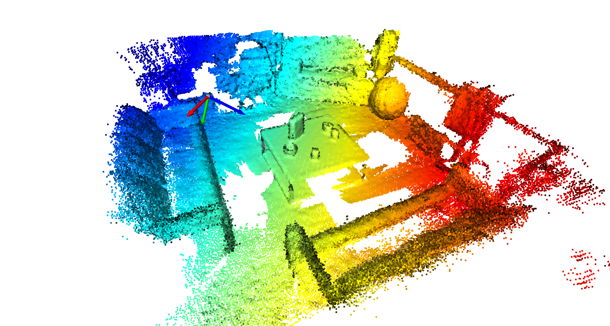

Parte 10 - SAVI
==============
Miguel Riem Oliveira <mriem@ua.pt>
2022-2023

# Sumário

- Processamento 3D;
- Iterative closest point;
- Deteção de objetos;
- Reconstrução 3D.

# Exercícios

## Exercício 1

Carregue a nuvem de pontos **scene.ply**, aplique um __downsampling__ para 0.02m, calcule as normais, visualize o resultado e mostre o sistema de coordenadas.

## Exercício 2

Por tentativa e erro, encontre uma transformação geométrica que coloque o sistema de coordenadas no centro da mesa com o eixo Z virado para cima.

Use as ferramentas do open3d para [aplicação de transformações geométricas](http://www.open3d.org/docs/latest/tutorial/geometry/transformation.html).

## Exercício 3

Produza uma nova nuvem de pontos que contenha apenas os pontos contidos numa caixa próxima da origem, e dessa forma isole os pontos da mesa.

Para isso deve utilizar a função de [crop](http://www.open3d.org/docs/release/python_api/open3d.geometry.PointCloud.html?highlight=crop#open3d.geometry.PointCloud.crop), que necessita de uma [AxisAlignedBoundingBox](http://www.open3d.org/docs/release/python_api/open3d.geometry.AxisAlignedBoundingBox.html#open3d.geometry.AxisAlignedBoundingBox), que por sua vez requer um [Vetor3D](http://www.open3d.org/docs/release/python_api/open3d.utility.Vector3dVector.html#open3d.utility.Vector3dVector).

## Exercício 4

Encontre o plano da mesa usando [RANSAC](http://www.open3d.org/docs/latest/tutorial/Basic/pointcloud.html#Plane-segmentation), e separe os pontos da mesa dos pontos dos objetos.

## Exercício 5

Utilizando [_clustering_](http://www.open3d.org/docs/latest/python_example/geometry/point_cloud/index.html#point-cloud-dbscan-clustering-py), separe cada objeto numa nuvem de pontos isolada.

## Exercício 6

Carregue também a nuvem de pontos da caixa de cereais (*cereal_box_2_2_40.pcd*) e use o algoritmo de [_Iterative Closest Point (ICP)_](http://www.open3d.org/docs/release/tutorial/pipelines/icp_registration.html) perceber qual dos objetos é a caixa de cereais.

Desenvolva uma [aplicação em open3d](http://www.open3d.org/docs/latest/python_example/visualization/index.html#text3d-py) que permita visualizar os nomes dos objetos e o resultado da deteção.

## Exercício 7

Utilizando o algoritmo de [alpha shapes](http://www.open3d.org/docs/latest/tutorial/Advanced/surface_reconstruction.html#Alpha-shapes), faça a reconstrução da superfície dos objetos, produzindo uma malha triangulada para cada um.

