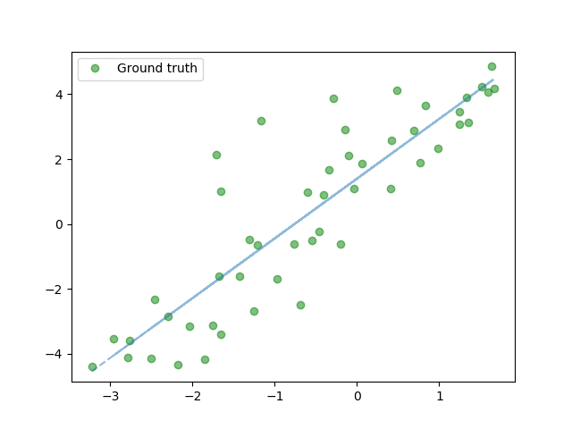
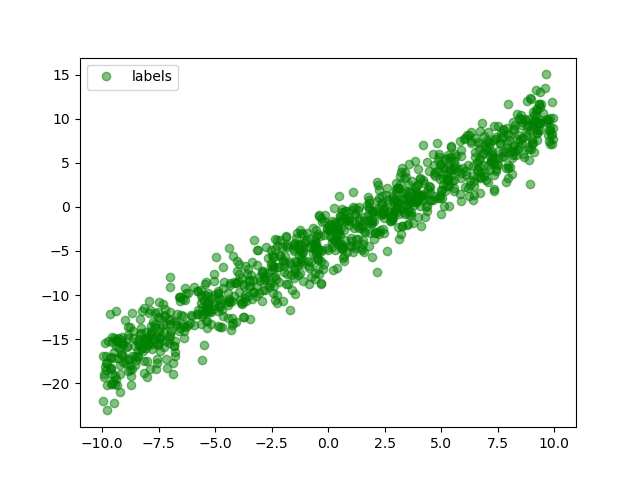
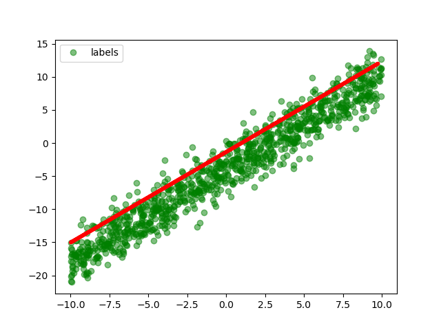
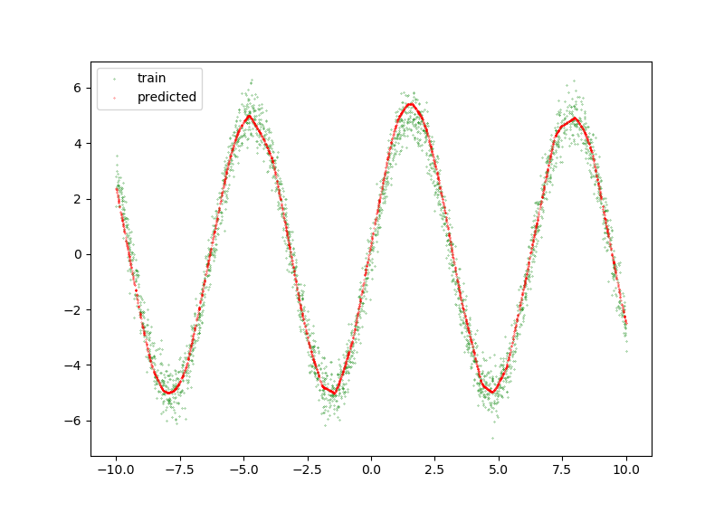
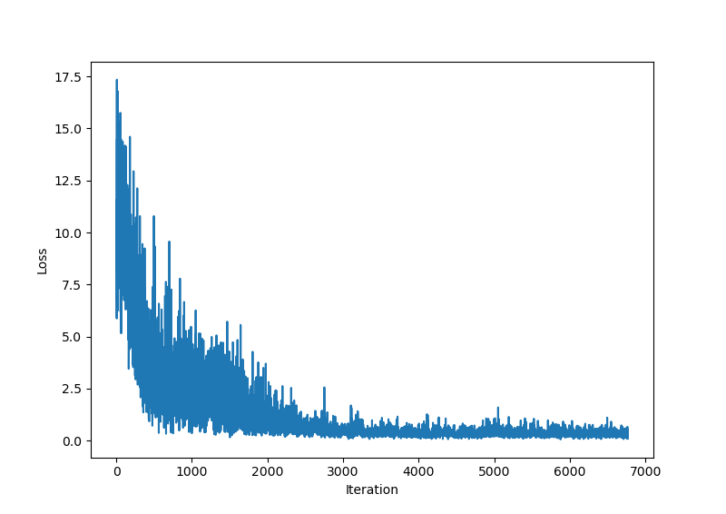
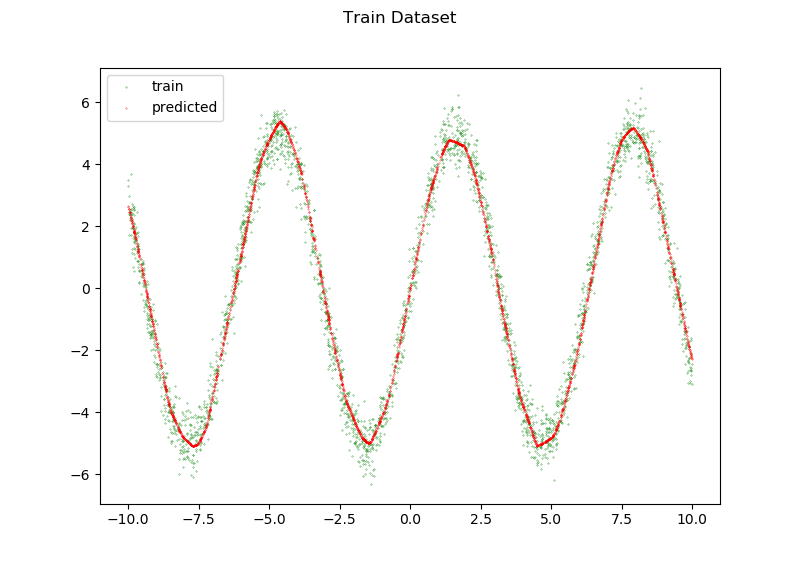
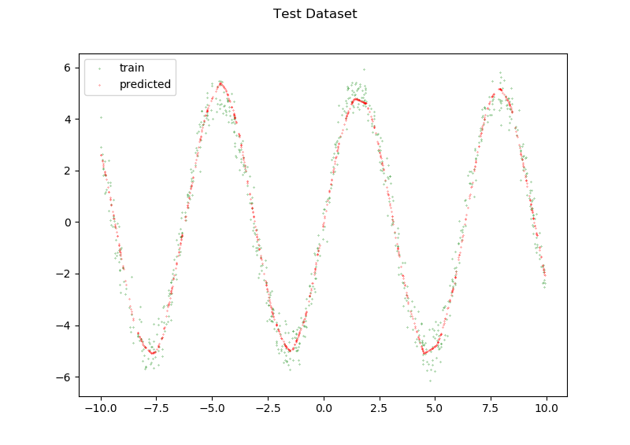

Parte 10 - SAVI
==============
Miguel Riem Oliveira <mriem@ua.pt>
2022-2023

# Sumário

Pytorch
Regressão com redes neuronais

# Exercícios

## Exercício 1

Use a aplicação desenvolvida na Parte07, Ex1 para gerar um conjunto de pontos de uma reta.
Depois, implemente em [Pytorch](https://pytorch.org/) uma [regressão linear com deep learning](https://towardsdatascience.com/linear-regression-with-pytorch-eb6dedead817).

## Exercício 2

Utilize a equação da reta $y = m x + b$ para gerar 3 milhões de pontos para $x \in [-10, 10]$, com um ruído associado a cada valor de y, i.e. $y = m x + b + \mathcal{N(0,\sigma)}$.

Defina uma class Dataset e um _dataset loader_ para os dados.

https://pytorch.org/tutorials/beginner/basics/data_tutorial.html

Treine a mesma rede e mostre o resultado.

## Exercício 3

Pretende-se treinar uma rede que aprenda uma função sinusoidal.

Comece por gerar 3000 dados para treino usando a expressão:

$y = sin(f \cdot x) \cdot a$

onde $f$ é a frequência e $a$ a amplitude da função sinusoidal.

Uma vez que a função sinusoidal é consideravelmente mais complexa, a rede terá de ser mais complexa para ser capaz de aprender esta função. Implemente uma nova rede com 4 camadas com tamanhos $[1,64,64,64,1]$, e com funções de ativação _relu_ à saída das três primeiras camadas.

No final do treino, desenhe os dados de treino e os dados da rede.

## Exercício 4

Desenhe um gráfico com o valor da _loss_ ao longo das épocas, de modo a perceber se o treino convergiu.

## Exercício 5

Crie um novo dataset de teste, e use-o para avaliar o modelo no final do treino com dados nunca antes observados pelo treino.

## Exercício 6

Faça as adaptações necessárias para que os dois gráficos sejam gerados dinamicamente durante o treino.

## Exercício 7

Desenhe a loss calculada com o _test dataset_ e acrescente-a à figura do exercício 4.